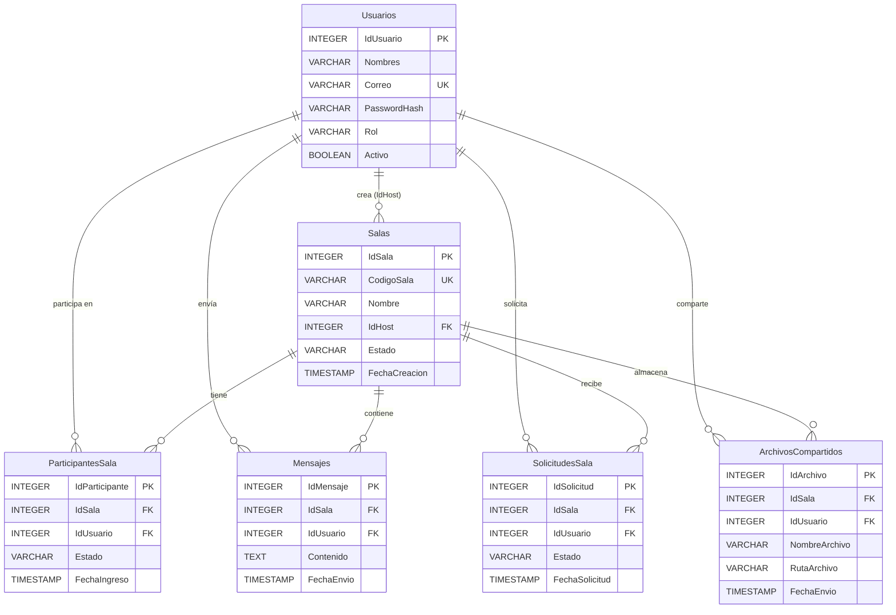
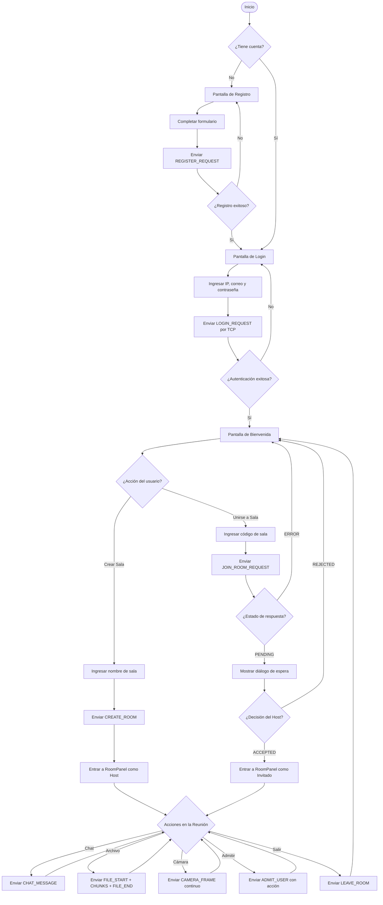
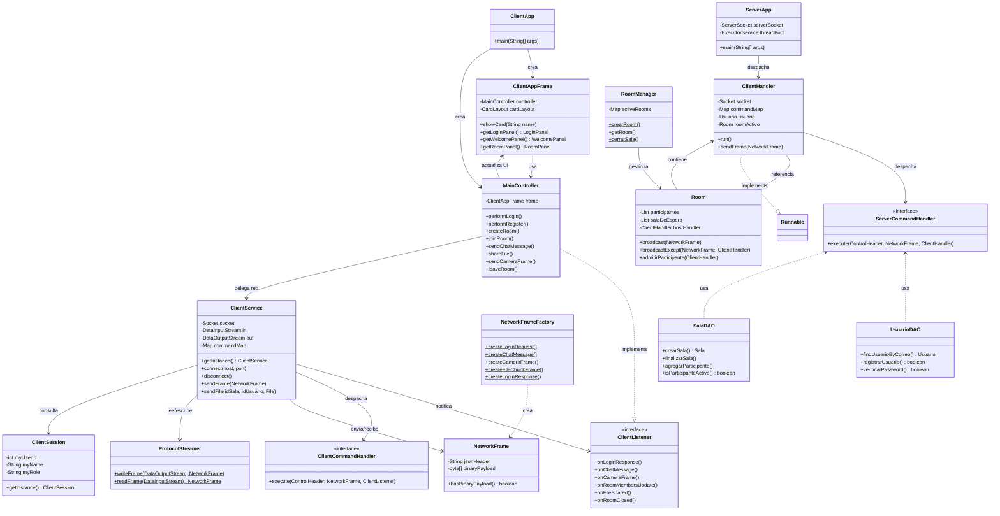
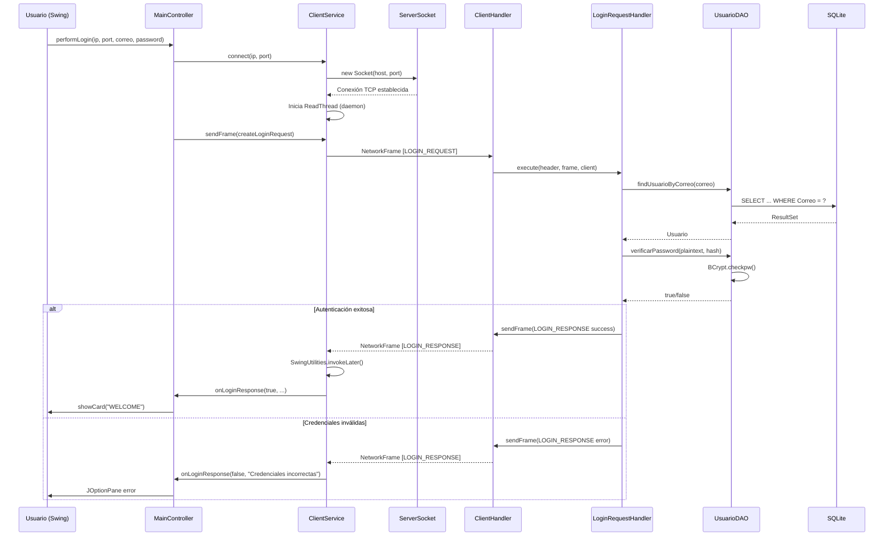

# 📡 Zoom-Sockets — Documentación Técnica del Proyecto

> **Prototipo de Videoconferencia en Tiempo Real con Sockets TCP, Java Swing y SQLite**

---

## 1. Encabezado y Descripción del Proyecto

### 1.1 Título

**Zoom-Sockets** — Sistema de Videoconferencia Cliente-Servidor basado en Sockets TCP puros con persistencia relacional y transmisión multimedia en tiempo real.

### 1.2 Resumen del Proyecto

Zoom-Sockets es un **prototipo académico de ingeniería de software** que replica las funcionalidades esenciales de una plataforma de videoconferencia moderna (inspirada en Zoom). El sistema implementa un modelo **Cliente-Servidor** sobre **Sockets TCP puros** (sin frameworks de alto nivel como Netty o gRPC), demostrando el dominio directo de la programación concurrente, los protocolos binarios personalizados y la comunicación en red a nivel de `java.net.Socket`.

**Funcionalidades principales implementadas:**

- **Autenticación segura** con hashing BCrypt contra base de datos SQLite.
- **Gestión de salas de reunión** con creación, admisión y sala de espera con estados.
- **Chat en tiempo real** con persistencia de mensajes en base de datos.
- **Transferencia de archivos fragmentada** (Chunked File Transfer) sobre TCP.
- **Transmisión de cámara en vivo** mediante compresión JPG y difusión de fotogramas.
- **Interfaz gráfica moderna** con Java Swing y tema FlatLaf Dark.

### 1.3 Tecnologías Principales

| Tecnología | Versión | Propósito |
|---|---|---|
| **Java (JDK)** | 21 | Lenguaje principal del sistema |
| **Apache Maven** | 3.x | Gestión de dependencias y compilación multi-módulo |
| **Sockets TCP** (`java.net.Socket`) | — | Comunicación de red Cliente-Servidor |
| **SQLite** (via `sqlite-jdbc`) | 3.45.2.0 | Motor de base de datos embebido para persistencia |
| **BCrypt** (`jBCrypt`) | 0.4 | Hashing seguro de contraseñas |
| **Gson** | 2.10.1 | Serialización/Deserialización JSON de cabeceras de protocolo |
| **Java Swing** | Incluido en JDK | Interfaz gráfica de usuario (GUI) |
| **FlatLaf** | 3.4.1 | Look & Feel moderno (tema Dark) para Swing |

---

## 2. Arquitectura General del Sistema

### 2.1 Modelo Cliente-Servidor

El sistema sigue una arquitectura **Cliente-Servidor centralizada** donde un único proceso de servidor (`ServerApp`) gestiona todas las conexiones, la lógica de negocio y la persistencia, mientras que múltiples instancias de cliente (`ClientApp`) se conectan simultáneamente desde diferentes máquinas o procesos.

```
┌─────────────────┐       TCP/8080       ┌──────────────────────┐
│   ClientApp #1  │◄────────────────────►│                      │
│   (Swing GUI)   │                      │     ServerApp        │
├─────────────────┤                      │                      │
│   ClientApp #2  │◄────────────────────►│  ┌────────────────┐  │
│   (Swing GUI)   │                      │  │  ThreadPool     │  │
├─────────────────┤                      │  │  (CachedThread) │  │
│   ClientApp #N  │◄────────────────────►│  └────────────────┘  │
│   (Swing GUI)   │                      │  ┌────────────────┐  │
└─────────────────┘                      │  │  SQLite DB      │  │
                                         │  │  (zoom_sockets) │  │
                                         │  └────────────────┘  │
                                         └──────────────────────┘
```

**Flujo general:**

1. El servidor arranca y escucha en el **puerto 8080** mediante un `ServerSocket`.
2. Por cada conexión entrante, se despacha un `ClientHandler` al `ExecutorService` (pool de hilos).
3. Cada `ClientHandler` mantiene su propio ciclo de lectura bloqueante sobre el `DataInputStream` del socket.
4. Las respuestas y difusiones (broadcasts) se envían de forma sincronizada a través del `DataOutputStream` correspondiente.

### 2.2 Gestión de Concurrencia

La concurrencia es un pilar fundamental del sistema y se gestiona en múltiples niveles:

#### En el Servidor

| Componente | Mecanismo | Descripción |
|---|---|---|
| `ServerApp` | `Executors.newCachedThreadPool()` | Pool de hilos dinámico que asigna un hilo dedicado a cada `ClientHandler`. Escala automáticamente según la demanda de conexiones. |
| `ClientHandler.sendFrame()` | `synchronized` | El método de envío está sincronizado para evitar escrituras concurrentes corruptas sobre un mismo `DataOutputStream`. |
| `Room.participantes` | `Collections.synchronizedList()` | Lista de participantes activos protegida contra accesos concurrentes. |
| `Room.salaDeEspera` | `Collections.synchronizedList()` | Lista de espera protegida de la misma forma. |
| `Room.broadcast()` | `synchronized (participantes)` | El bloque de difusión sincroniza explícitamente sobre la lista para iterar de forma segura. |
| `RoomManager.activeRooms` | `ConcurrentHashMap` | Registro global de salas activas con acceso concurrente seguro sin bloqueo global. |
| `DatabaseConnection.getConnection()` | `synchronized` | Acceso sincronizado para la inicialización del esquema de base de datos. |

#### En el Cliente

| Componente | Mecanismo | Descripción |
|---|---|---|
| `ClientService` (Hilo principal) | Hilo de envío UI | Las acciones del usuario desde Swing se envían al servidor a través del hilo del EDT (Event Dispatch Thread). |
| `ClientService` (Hilo de lectura) | `Thread("ZoomSockets-ReadThread")` | Hilo daemon dedicado que ejecuta un bucle bloqueante de lectura de tramas. |
| `SwingUtilities.invokeLater()` | EDT Delegation | Cada trama recibida en el hilo de red se despacha al hilo de UI Swing mediante `invokeLater()`, evitando bloqueos de pantalla y condiciones de carrera sobre los componentes gráficos. |
| `ClientService.sendFile()` | `Thread("FileSenderThread")` | Hilo separado para no bloquear la UI durante la transferencia de archivos grandes. |
| `ClientSession` | `synchronized` (Singleton) | Instancia única protegida contra acceso concurrente en su creación. |

### 2.3 Protocolo de Comunicación Binario

El sistema implementa un **protocolo binario estricto** basado en tramas (`NetworkFrame`), diseñado específicamente para evitar la mezcla de flujos de datos textuales y binarios que genera corrupción cuando se usan `PrintWriter`/`BufferedReader` junto con flujos de bytes crudos.

#### Estructura de una Trama (`NetworkFrame`)

```
┌─────────────────────────────────────────────────────────────┐
│  4 bytes  │   N bytes         │  4 bytes  │   M bytes       │
│ (int)     │ (UTF-8 JSON)      │ (int)     │ (raw binary)    │
├───────────┼───────────────────┼───────────┼─────────────────┤
│ jsonLen   │ ControlHeader     │ binLen    │ Payload binario  │
│           │ (cabecera JSON)   │           │ (imagen, chunk)  │
└─────────────────────────────────────────────────────────────┘
```

**Detalle del protocolo (implementado en `ProtocolStreamer`):**

1. **`writeFrame(DataOutputStream, NetworkFrame)`**: Escribe la trama completa.
   - Escribe `jsonLength` (4 bytes, `writeInt`).
   - Escribe el JSON de la cabecera en bytes UTF-8.
   - Escribe `binaryLength` (4 bytes, `writeInt`).
   - Escribe el payload binario (si existe).
   - Ejecuta `flush()`.

2. **`readFrame(DataInputStream)`**: Lee una trama completa de forma síncrona.
   - Lee `jsonLength` y valida contra un máximo de **1 MB**.
   - Lee los bytes de la cabecera JSON con `readFully()`.
   - Lee `binaryLength` y valida contra un máximo de **16 MB**.
   - Lee el payload binario con `readFully()`.

**Ventajas del diseño:**

- **Separación limpia** entre metadatos (JSON) y datos crudos (bytes).
- **Validación de tamaños** para evitar ataques de saturación de memoria.
- **Compatibilidad** con todos los tipos de datos: texto, archivos binarios e imágenes de cámara.

#### Cabecera de Control (`ControlHeader`)

El `ControlHeader` es un objeto Java serializado a JSON con **Gson**, que contiene campos polimórficos utilizados según el `CommandType`:

```json
{
  "type": "CHAT_MESSAGE",
  "idSala": 1,
  "idUsuario": 3,
  "nombres": "Juan Pérez",
  "contenido": "Hola a todos"
}
```

Los campos principales incluyen: `type`, `status`, `error`, `success`, `email`, `password`, `idUsuario`, `nombres`, `rol`, `idSala`, `codigoSala`, `nombreSala`, `action`, `contenido`, `nombreArchivo`, `idArchivo`, `pendingUsers` y `activeUsers`.

---

## 3. Estructura de Módulos y Carpetas

### 3.1 Arquitectura Multi-Módulo Maven

El proyecto utiliza un **POM padre** (`zoom-sockets-parent`) que agrupa tres módulos independientes con sus propias dependencias:

```
zoom-sockets-parent (POM)
 ├── zoom-sockets-common   ← Clases compartidas (modelos + protocolo)
 ├── zoom-sockets-server   ← Servidor de red + lógica + persistencia
 └── zoom-sockets-client   ← Cliente GUI Swing + red
```

### 3.2 Árbol de Directorios Detallado

```
PC4/
├── pom.xml                                    # POM padre multi-módulo
├── zoom_sockets.db                            # Base de datos SQLite (generada)
├── uploads/                                   # Directorio de archivos compartidos
│
├── zoom-sockets-common/
│   ├── pom.xml
│   └── src/main/java/com/zoomsockets/
│       ├── model/
│       │   ├── ArchivoCompartido.java         # Modelo: archivo compartido en sala
│       │   ├── Mensaje.java                   # Modelo: mensaje de chat
│       │   ├── ParticipanteSala.java          # Modelo: participante activo en sala
│       │   ├── Sala.java                      # Modelo: sala de reunión
│       │   ├── SolicitudSala.java             # Modelo: solicitud de ingreso a sala
│       │   └── Usuario.java                   # Modelo: usuario del sistema
│       └── protocol/
│           ├── CommandType.java               # Enum: tipos de comando del protocolo
│           ├── ControlHeader.java             # Cabecera JSON de control (serializable)
│           ├── NetworkFrame.java              # Trama de red (header JSON + payload binario)
│           ├── NetworkFrameFactory.java       # Fábrica de tramas (Factory Method)
│           └── ProtocolStreamer.java           # Lectura/escritura binaria de tramas
│
├── zoom-sockets-server/
│   ├── pom.xml
│   └── src/main/
│       ├── java/com/zoomsockets/
│       │   ├── ServerApp.java                 # Punto de entrada del servidor
│       │   ├── db/
│       │   │   ├── DatabaseConnection.java    # Conexión y bootstrap de BD
│       │   │   ├── UsuarioDAO.java            # DAO: operaciones sobre Usuarios
│       │   │   ├── SalaDAO.java               # DAO: operaciones sobre Salas
│       │   │   ├── MensajeDAO.java            # DAO: operaciones sobre Mensajes
│       │   │   ├── SolicitudSalaDAO.java      # DAO: operaciones sobre Solicitudes
│       │   │   └── ArchivoCompartidoDAO.java  # DAO: operaciones sobre Archivos
│       │   └── server/
│       │       ├── ClientHandler.java         # Manejador de conexión por cliente
│       │       ├── Room.java                  # Sala en memoria (participantes + broadcast)
│       │       ├── RoomManager.java           # Registro global de salas activas
│       │       └── command/
│       │           ├── ServerCommandHandler.java       # Interfaz: Command Pattern
│       │           ├── LoginRequestHandler.java        # Comando: login
│       │           ├── RegisterRequestHandler.java     # Comando: registro
│       │           ├── CreateRoomHandler.java          # Comando: crear sala
│       │           ├── JoinRoomRequestHandler.java     # Comando: unirse a sala
│       │           ├── AdmitUserHandler.java           # Comando: admitir/rechazar
│       │           ├── ChatMessageHandler.java         # Comando: mensaje de chat
│       │           ├── CameraFrameHandler.java         # Comando: fotograma de cámara
│       │           ├── FileStartHandler.java           # Comando: inicio de archivo
│       │           ├── FileChunkHandler.java           # Comando: fragmento de archivo
│       │           ├── FileEndHandler.java             # Comando: fin de archivo
│       │           ├── FileDownloadRequestHandler.java # Comando: descarga de archivo
│       │           ├── FileTransferContext.java        # Estado de transferencia en curso
│       │           ├── LeaveRoomHandler.java           # Comando: salir de sala
│       │           └── ChangeNameHandler.java          # Comando: cambiar nombre
│       └── resources/
│           ├── schema.sql                     # DDL de inicialización de BD
│           └── db.properties                  # Configuración de conexión a BD
│
└── zoom-sockets-client/
    ├── pom.xml
    └── src/main/java/com/zoomsockets/
        ├── ClientApp.java                     # Punto de entrada del cliente
        ├── client/
        │   ├── ClientService.java             # Servicio de red (Singleton, send/listen)
        │   ├── ClientListener.java            # Interfaz Observer para eventos de red
        │   └── command/
        │       ├── ClientCommandHandler.java          # Interfaz: Command Pattern
        │       ├── LoginResponseHandler.java          # Comando: respuesta login
        │       ├── RegisterResponseHandler.java       # Comando: respuesta registro
        │       ├── CreateRoomResponseHandler.java     # Comando: respuesta crear sala
        │       ├── JoinRoomResponseHandler.java       # Comando: respuesta unirse
        │       ├── WaitingRoomUpdateHandler.java      # Comando: actualización de espera
        │       ├── RoomMembersUpdateHandler.java      # Comando: miembros de sala
        │       ├── ChatMessageHandler.java            # Comando: mensaje chat recibido
        │       ├── CameraFrameHandler.java            # Comando: fotograma de cámara
        │       ├── FileSharedHandler.java             # Comando: notificación archivo
        │       ├── FileDownloadResponseHandler.java   # Comando: descarga recibida
        │       ├── RoomTerminatedHandler.java         # Comando: sala finalizada
        │       └── RoomClosedHandler.java             # Comando: sala cerrada
        ├── controller/
        │   └── MainController.java            # Controlador principal (implementa Observer)
        ├── model/
        │   └── ClientSession.java             # Sesión del usuario (Singleton)
        └── view/
            ├── ClientAppFrame.java            # JFrame principal con CardLayout
            ├── components/
            │   └── ParticipantVideoPanel.java # Panel de video por participante
            └── panels/
                ├── LoginPanel.java            # Panel de inicio de sesión
                ├── RegisterPanel.java         # Panel de registro
                ├── WelcomePanel.java          # Panel de bienvenida (lobby)
                └── RoomPanel.java             # Panel de reunión (chat + video + archivos)
```

### 3.3 Responsabilidad de Cada Módulo

#### `zoom-sockets-common`

Módulo **compartido** por servidor y cliente. Contiene los artefactos que ambos lados necesitan para comunicarse de forma coherente:

- **`model/`**: POJOs (Plain Old Java Objects) que representan las entidades de dominio: `Usuario`, `Sala`, `Mensaje`, `ParticipanteSala`, `SolicitudSala` y `ArchivoCompartido`. Estos modelos son utilizados tanto para la persistencia en el servidor como para la serialización en las cabeceras del protocolo.
- **`protocol/`**: Define el protocolo de comunicación binario completo, incluyendo el enum `CommandType` (vocabulario de comandos), `ControlHeader` (cabecera JSON serializable), `NetworkFrame` (trama binaria con header + payload) y `NetworkFrameFactory` (fábrica de tramas).

#### `zoom-sockets-server`

Módulo del **servidor**, responsable de toda la lógica de negocio, concurrencia y persistencia:

- **`ServerApp`**: Punto de entrada. Inicializa la base de datos, configura el `ServerSocket` en el puerto 8080, crea un `CachedThreadPool` y despacha cada conexión a un `ClientHandler`.
- **`server/`**: Núcleo de red con `ClientHandler` (ciclo de vida de un cliente conectado), `Room` (sala en memoria con listas sincronizadas de participantes y métodos de broadcast) y `RoomManager` (registro global estático de salas activas usando `ConcurrentHashMap`).
- **`server/command/`**: Implementaciones concretas del patrón Command para cada tipo de petición, desde autenticación hasta transmisión de cámara.
- **`db/`**: Capa de persistencia con `DatabaseConnection` (gestión de conexión y bootstrap del esquema) y los DAOs especializados por entidad.

#### `zoom-sockets-client`

Módulo del **cliente GUI**, responsable de la presentación, interacción del usuario y comunicación con el servidor:

- **`ClientApp`**: Punto de entrada. Configura FlatLaf Dark y lanza el `MainController` + `ClientAppFrame` en el EDT de Swing.
- **`client/`**: Capa de red del cliente con `ClientService` (Singleton con conexión TCP, envío y hilo de lectura daemon), `ClientListener` (interfaz Observer) y los handlers de respuesta.
- **`controller/`**: `MainController` implementa `ClientListener` y actúa como puente entre la capa de red y la UI, delegando acciones hacia `ClientService` y actualizando los paneles Swing.
- **`model/`**: `ClientSession` (Singleton) almacena el estado local de la sesión del usuario autenticado.
- **`view/`**: Paneles Swing organizados con `CardLayout` en `ClientAppFrame`: `LoginPanel`, `RegisterPanel`, `WelcomePanel` y `RoomPanel`.

---

## 4. Patrones de Diseño Aplicados

### 4.1 Patrón Command (Comando)

**Problema que resuelve:** Sin este patrón, el procesamiento de tramas de red requeriría un bloque `switch-case` o `if-else` masivo dentro de `ClientHandler` (servidor) o `ClientService` (cliente), con docenas de ramas que crecerían con cada nueva funcionalidad, violando el **Principio Abierto/Cerrado (OCP)**.

**Implementación:**

Se definen dos interfaces de comando, una por cada lado de la comunicación:

```java
// Servidor
public interface ServerCommandHandler {
    void execute(ControlHeader header, NetworkFrame frame, ClientHandler client);
}

// Cliente
public interface ClientCommandHandler {
    void execute(ControlHeader header, NetworkFrame frame, ClientListener listener);
}
```

Cada tipo de comando tiene su **implementación concreta**:

| Lado | Comando (`CommandType`) | Handler Concreto |
|---|---|---|
| Servidor | `LOGIN_REQUEST` | `LoginRequestHandler` |
| Servidor | `REGISTER_REQUEST` | `RegisterRequestHandler` |
| Servidor | `CREATE_ROOM` | `CreateRoomHandler` |
| Servidor | `JOIN_ROOM_REQUEST` | `JoinRoomRequestHandler` |
| Servidor | `ADMIT_USER` | `AdmitUserHandler` |
| Servidor | `CHAT_MESSAGE` | `ChatMessageHandler` |
| Servidor | `CAMERA_FRAME` | `CameraFrameHandler` |
| Servidor | `FILE_START` / `FILE_CHUNK` / `FILE_END` | `FileStartHandler` / `FileChunkHandler` / `FileEndHandler` |
| Servidor | `FILE_DOWNLOAD_REQUEST` | `FileDownloadRequestHandler` |
| Servidor | `LEAVE_ROOM` | `LeaveRoomHandler` |
| Servidor | `CHANGE_NAME_REQUEST` | `ChangeNameHandler` |
| Cliente | `LOGIN_RESPONSE` | `LoginResponseHandler` |
| Cliente | `CREATE_ROOM_RESPONSE` | `CreateRoomResponseHandler` |
| Cliente | `JOIN_ROOM_RESPONSE` | `JoinRoomResponseHandler` |
| Cliente | `CHAT_MESSAGE` | `ChatMessageHandler` |
| Cliente | `CAMERA_FRAME` | `CameraFrameHandler` |
| Cliente | `ROOM_CLOSED` | `RoomClosedHandler` |

**Enrutamiento:** En `ClientHandler` y `ClientService`, se utiliza un `Map<String, Handler>` que mapea el `CommandType.name()` al handler concreto:

```java
// Fragmento de ClientHandler (servidor)
commandMap.put(CommandType.LOGIN_REQUEST.name(), new LoginRequestHandler());
commandMap.put(CommandType.CHAT_MESSAGE.name(), new ChatMessageHandler());
// ...

// Despacho
ServerCommandHandler handler = commandMap.get(type);
if (handler != null) {
    handler.execute(header, frame, this);
}
```

**Beneficio:** Agregar un nuevo tipo de comando solo requiere: (1) agregar una entrada al enum `CommandType`, (2) crear una clase handler concreta y (3) registrarla en el `commandMap`. **Cero modificaciones** en la lógica de despacho existente.

---

### 4.2 Patrón Factory Method (Método Fábrica)

**Problema que resuelve:** La creación de tramas de red (`NetworkFrame`) requiere instanciar un `ControlHeader`, configurar múltiples campos según el contexto, serializarlo a JSON y construir el `NetworkFrame`. Sin centralizar esta lógica, cada clase que envía tramas duplicaría este código propenso a errores.

**Implementación:** La clase `NetworkFrameFactory` centraliza la creación de **todas** las tramas del sistema mediante métodos estáticos semánticos:

```java
public class NetworkFrameFactory {
    // --- Peticiones del Cliente ---
    public static NetworkFrame createLoginRequest(String email, String password) { ... }
    public static NetworkFrame createChatMessage(String contenido) { ... }
    public static NetworkFrame createCameraFrame(byte[] imageBytes) { ... }
    public static NetworkFrame createFileStartFrame(int roomId, int userId, String fileName, long fileSize) { ... }
    public static NetworkFrame createFileChunkFrame(byte[] chunkData) { ... }
    public static NetworkFrame createFileEndFrame() { ... }

    // --- Respuestas del Servidor ---
    public static NetworkFrame createLoginResponse(boolean success, String error, Usuario user) { ... }
    public static NetworkFrame createChatBroadcast(int idSala, int idUsuario, String nombres, String contenido) { ... }
    public static NetworkFrame createRoomMembersUpdate(List<Usuario> activeUsers) { ... }
    public static NetworkFrame createFileSharedNotification(...) { ... }
    // ... 20+ métodos de fábrica
}
```

**Beneficios:**

- **Semántica clara:** `createLoginRequest(email, password)` es más expresivo que construir manualmente un `ControlHeader` con 5 setters.
- **Reducción de errores:** Imposible olvidar un campo obligatorio.
- **Punto único de cambio:** Si cambia la estructura interna de una trama, solo se modifica el método de fábrica correspondiente.

---

### 4.3 Patrón DAO (Data Access Object)

**Problema que resuelve:** Acoplar las consultas SQL directamente en la lógica de negocio (en los handlers de comando) haría que los cambios en el esquema de la base de datos se propagaran por todo el código. Además, dificultaría la migración a otro motor de base de datos.

**Implementación:** Cada entidad de dominio tiene su DAO correspondiente:

| DAO | Entidad | Operaciones principales |
|---|---|---|
| `UsuarioDAO` | `Usuarios` | `findUsuarioByCorreo()`, `registrarUsuario()`, `verificarPassword()` |
| `SalaDAO` | `Salas`, `ParticipantesSala` | `crearSala()`, `finalizarSala()`, `agregarParticipante()`, `removerParticipante()`, `isParticipanteActivo()` |
| `MensajeDAO` | `Mensajes` | `guardarMensaje()` |
| `SolicitudSalaDAO` | `SolicitudesSala` | `crearSolicitud()`, `getPendientesPorSala()`, `actualizarSolicitudPorUsuarioYSala()` |
| `ArchivoCompartidoDAO` | `ArchivosCompartidos` | `guardarArchivo()`, `obtenerArchivoPorId()` |

**Patrón de acceso:**

```java
// Cada método abre y cierra su propia conexión (patrón Connection-per-Operation)
public Usuario findUsuarioByCorreo(String correo) {
    String sql = "SELECT ... FROM Usuarios WHERE Correo = ?";
    try (Connection conn = DatabaseConnection.getConnection();
         PreparedStatement ps = conn.prepareStatement(sql)) {
        ps.setString(1, correo);
        try (ResultSet rs = ps.executeQuery()) {
            if (rs.next()) {
                return new Usuario(rs.getInt("IdUsuario"), ...);
            }
        }
    }
    return null;
}
```

**Características adicionales del diseño de persistencia:**

- La clase `DatabaseConnection` soporta **múltiples motores** (SQLite, PostgreSQL, MySQL) mediante configuración en `db.properties`, permitiendo una futura migración sin cambios en los DAOs.
- La inicialización del esquema (`schema.sql`) se ejecuta automáticamente al primer arranque usando sentencias `CREATE TABLE IF NOT EXISTS`, asegurando idempotencia.
- Se incluyen **datos semilla** (3 usuarios preconfigurados con contraseña `password123` hasheada con BCrypt).

---

### 4.4 Patrón Observer (Observador)

**Problema que resuelve:** El hilo de lectura de red (`ZoomSockets-ReadThread`) del cliente recibe tramas de forma asíncrona y bloqueante. Si actualizara directamente los componentes Swing desde ese hilo, violaría el modelo de threading de Swing (que exige que toda modificación de UI ocurra en el EDT), provocando **congelamientos de pantalla, condiciones de carrera y artefactos gráficos**.

**Implementación:**

```
┌──────────────────┐  notifica  ┌────────────────────┐  actualiza  ┌──────────────┐
│  ClientService   │───────────►│  MainController    │────────────►│  Paneles     │
│  (Subject)       │            │  (Concrete Observer)│            │  Swing (UI)  │
│                  │            │  implements         │            │              │
│  Hilo de lectura │            │  ClientListener     │            │  LoginPanel  │
│  (daemon)        │            │                    │            │  RoomPanel   │
└──────────────────┘            └────────────────────┘            │  WelcomePanel│
                                                                  └──────────────┘
```

**Interfaz Observer — `ClientListener`:**

```java
public interface ClientListener {
    void onLoginResponse(boolean success, String error, String name, String role, int idUsuario);
    void onRegisterResponse(boolean success, String error);
    void onCreateRoomResponse(boolean success, String error, String codigoSala, String nombreSala, int idSala);
    void onJoinRoomResponse(String status, String error, int idSala, String nombreSala);
    void onWaitingRoomUpdate(List<SolicitudSala> pendingUsers);
    void onRoomMembersUpdate(List<Usuario> activeUsers);
    void onChatMessage(String senderName, String content, int senderId);
    void onFileShared(String senderName, String filename, String physicalName, int idArchivo);
    void onFileDownloadComplete(String destPath);
    void onFileDownloadFailed(String error);
    void onCameraFrame(int userId, String userName, byte[] imageBytes);
    void onRoomTerminated();
    void onRoomClosed(String mensaje);
}
```

**Flujo de notificación:**

1. El hilo daemon de red lee una trama: `ProtocolStreamer.readFrame(in)`.
2. Se despacha al EDT: `SwingUtilities.invokeLater(() -> procesarTramaRecibida(frame))`.
3. Dentro del EDT, el `ClientCommandHandler` correspondiente extrae los datos de la cabecera.
4. Se invoca el método apropiado del `ClientListener` (implementado por `MainController`).
5. `MainController` actualiza los paneles Swing de forma segura (ya estamos en el EDT).

**Beneficio fundamental:** Desacoplamiento total entre la capa de red y la UI. Se pueden cambiar los paneles Swing sin tocar la lógica de red, y viceversa.

---

### 4.5 Patrón Singleton

**Aplicado en:**

- **`ClientService`**: Garantiza una única conexión TCP activa en el cliente, evitando múltiples sockets abiertos.
- **`ClientSession`**: Mantiene una única instancia del estado de sesión del usuario (ID, nombre, rol, sala activa).

Ambos usan **lazy initialization con `synchronized`** para seguridad en entornos multi-hilo.

---

## 5. Diagramas del Sistema

### 5.1 Diagrama de Casos de Uso

```mermaid
graph TB
    subgraph Sistema["Sistema Zoom-Sockets"]
        UC1["Registrar cuenta"]
        UC2["Iniciar sesión"]
        UC3["Crear sala de reunión"]
        UC4["Unirse a sala por código"]
        UC5["Enviar mensajes de chat"]
        UC6["Compartir archivos"]
        UC7["Descargar archivos"]
        UC8["Transmitir cámara en vivo"]
        UC9["Ver cámaras de participantes"]
        UC10["Gestionar sala de espera"]
        UC11["Admitir/Rechazar invitados"]
        UC12["Cerrar sala"]
        UC13["Abandonar sala"]
        UC14["Cambiar nombre"]
    end

    Host["🎓 Host (Docente)"]
    Invitado["👤 Invitado (Estudiante)"]

    %% Acciones exclusivas del Host
    Host --> UC3
    Host --> UC10
    Host --> UC11
    Host --> UC12

    %% Acciones exclusivas del Invitado
    Invitado --> UC4

    %% Acciones compartidas
    Host --> UC1
    Host --> UC2
    Host --> UC5
    Host --> UC6
    Host --> UC7
    Host --> UC8
    Host --> UC9
    Host --> UC13
    Host --> UC14

    Invitado --> UC1
    Invitado --> UC2
    Invitado --> UC5
    Invitado --> UC6
    Invitado --> UC7
    Invitado --> UC8
    Invitado --> UC9
    Invitado --> UC13
    Invitado --> UC14
```



### 5.2 Diagrama Entidad-Relación (ER)



### 5.3 Diagrama de Actividades — Flujo General del Usuario



### 5.4 Diagrama de Clases (Resumido)



### 5.5 Diagrama de Secuencia — Flujo de Autenticación



---

## 6. Gestión de Flujos Específicos

### 6.1 Autenticación

El flujo de autenticación combina conexión TCP, envío de credenciales sobre el protocolo binario y validación con hashing seguro:

**Proceso detallado:**

1. **Conexión:** El cliente establece una conexión TCP con `new Socket(host, port)` hacia el servidor.
2. **Envío de credenciales:** Se crea una trama `LOGIN_REQUEST` con email y contraseña en texto plano (dentro de la cabecera JSON, sobre TCP directo).
3. **Búsqueda en BD:** El `LoginRequestHandler` en el servidor consulta `UsuarioDAO.findUsuarioByCorreo()`, que ejecuta un `SELECT` con `PreparedStatement` parametrizado (prevención de SQL Injection).
4. **Verificación BCrypt:** Se compara la contraseña enviada contra el hash almacenado usando `BCrypt.checkpw(passwordPlana, passwordHash)`.
5. **Validación de estado:** Se verifica que el campo `Activo` del usuario sea `true`.
6. **Respuesta:** Se envía una trama `LOGIN_RESPONSE` con `success=true|false` y datos del usuario o mensaje de error.

**Seguridad implementada:**

- Las contraseñas **nunca** se almacenan en texto plano; se usa **BCrypt** con `gensalt()` (salt aleatorio por usuario).
- El hash se almacena en la columna `PasswordHash` de la tabla `Usuarios`.
- Se utilizan `PreparedStatement` para prevenir inyección SQL.

> **Nota de seguridad:** En esta versión prototipo, las credenciales viajan en texto plano sobre TCP. En un entorno de producción, sería obligatorio implementar TLS/SSL para cifrar el canal de comunicación.

---

### 6.2 Sala de Espera (Waiting Room)

La sala de espera implementa un flujo de **admisión controlada** donde el Host debe aceptar o rechazar explícitamente a cada participante que solicite unirse.

**Estados de una solicitud (`SolicitudSala.estado`):**

| Estado | Significado |
|---|---|
| `Pendiente` | El invitado ha enviado la solicitud y espera decisión del Host. |
| `Aceptada` | El Host ha admitido al invitado; puede ingresar a la sala activa. |
| `Rechazada` | El Host ha rechazado al invitado; recibe notificación de denegación. |

**Flujo detallado:**

1. **Solicitud de ingreso:** El invitado envía `JOIN_ROOM_REQUEST` con el código de la sala.
2. **Validación:** El servidor verifica que la sala exista y esté activa (en `RoomManager`).
3. **Registro en BD:** Se crea un registro en `SolicitudesSala` con estado `Pendiente` vía `SolicitudSalaDAO`.
4. **Registro en memoria:** El `ClientHandler` del invitado se agrega a `Room.salaDeEspera`.
5. **Notificación al invitado:** Se envía `JOIN_ROOM_RESPONSE` con `status="PENDING"` → el cliente muestra un diálogo modal de espera.
6. **Notificación al Host:** Se envía `WAITING_ROOM_UPDATE` con la lista actualizada de solicitudes pendientes.
7. **Decisión del Host:** El Host envía `ADMIT_USER` con `action="ACCEPT"` o `action="REJECT"`.
8. **Procesamiento:**
   - **Si acepta:** Se actualiza la solicitud a `Aceptada` en BD, se mueve el handler de `salaDeEspera` a `participantes`, se envía `JOIN_ROOM_RESPONSE` con `status="SUCCESS"`, y se difunde `ROOM_MEMBERS_UPDATE` a todos.
   - **Si rechaza:** Se actualiza a `Rechazada`, se remueve de `salaDeEspera`, y se envía `JOIN_ROOM_RESPONSE` con `status="REJECTED"`.

---

### 6.3 Transferencia de Archivos (Chunked Transfer)

Los archivos se transmiten usando un protocolo de **transferencia fragmentada** en tres fases, diseñado para evitar la carga completa del archivo en memoria RAM:

**Protocolo de tres fases:**

```
Fase 1: FILE_START    →  Metadatos (nombre, tamaño, IDs)
Fase 2: FILE_CHUNK    →  Fragmentos de 8 KB (N veces)
Fase 3: FILE_END      →  Señal de finalización
```

**Flujo detallado (lado cliente — `ClientService.sendFile()`):**

1. **FILE_START:** Se envía una trama con `CommandType.FILE_START`, incluyendo `idSala`, `idUsuario`, `nombreArchivo` y `fileSize` en la cabecera JSON. **No hay payload binario en esta trama.**
2. **FILE_CHUNK (N veces):** Se lee el archivo en bloques de **8192 bytes (8 KB)**. Cada bloque se envía como una trama con `CommandType.FILE_CHUNK` en la cabecera y los bytes del fragmento como **payload binario** del `NetworkFrame`.
3. **FILE_END:** Se envía una trama de señalización con `CommandType.FILE_END` y sin payload, indicando que la transferencia se ha completado.

**Flujo detallado (lado servidor):**

1. `FileStartHandler`: Crea un `FileOutputStream` hacia un archivo temporal en el directorio `uploads/`, registra el nombre original y almacena el contexto en `FileTransferContext`.
2. `FileChunkHandler`: Escribe el payload binario de cada trama directamente al `FileOutputStream`.
3. `FileEndHandler`: Cierra el stream, registra el archivo en la tabla `ArchivosCompartidos` vía `ArchivoCompartidoDAO`, y difunde una notificación `FILE_SHARED` a todos los participantes de la sala.

**Limitaciones:**

- Tamaño máximo de archivo: **15 MB** (validado en el cliente).
- Tamaño máximo de payload binario por trama: **16 MB** (validado en `ProtocolStreamer`).
- La transferencia se ejecuta en un hilo separado (`FileSenderThread`) para no bloquear la UI.

---

### 6.4 Transmisión de Cámara

La transmisión de video en vivo se implementa como un flujo continuo de **fotogramas JPEG** independientes enviados y renderizados asíncronamente:

**Flujo de captura y envío (Cliente):**

1. **Captura:** El `RoomPanel` captura fotogramas de la webcam usando la API de `java.awt` / bibliotecas de captura.
2. **Compresión:** Cada fotograma se comprime a formato **JPEG** como array de bytes (`byte[]`).
3. **Envío:** Se invoca `MainController.sendCameraFrame(jpegBytes)`, que crea una trama `CAMERA_FRAME` con los bytes JPEG como payload binario mediante `NetworkFrameFactory.createCameraFrame(imageBytes)`.

**Flujo de retransmisión (Servidor — `CameraFrameHandler`):**

1. Recibe la trama `CAMERA_FRAME` del cliente emisor.
2. Valida que el usuario esté autenticado y sea participante activo de la sala (`SalaDAO.isParticipanteActivo()`).
3. Construye una trama de retransmisión con `createCameraFrameRelay()`, que incluye el `idUsuario` y `nombres` del emisor en la cabecera para identificación.
4. Difunde la trama a **todos los participantes activos excepto al emisor** usando `Room.broadcastExcept()`.

**Flujo de recepción y renderizado (Cliente):**

1. El `CameraFrameHandler` del cliente extrae `idUsuario`, `userName` y los bytes de imagen del `NetworkFrame`.
2. Invoca `ClientListener.onCameraFrame(userId, userName, imageBytes)`.
3. `MainController` delega a `RoomPanel.updateParticipantCamera()`.
4. El `ParticipantVideoPanel` correspondiente decodifica los bytes JPEG a un `BufferedImage` y lo repinta en su `JPanel`.

**Características del diseño:**

- **Sin buffering acumulativo:** Cada fotograma es independiente; no se usa buffer circular ni codificación inter-frame (como H.264). Esto simplifica la implementación pero incrementa el consumo de ancho de banda.
- **Apagado de cámara:** Enviar un `CAMERA_FRAME` con payload vacío (`new byte[0]`) indica que el usuario ha desactivado su cámara.

---

## 7. Guía de Instalación y Ejecución

### 7.1 Prerrequisitos

| Requisito | Versión mínima | Verificación |
|---|---|---|
| **JDK (Java Development Kit)** | 17+ (recomendado 21) | `java -version` |
| **Apache Maven** | 3.6+ | `mvn -version` |
| **Cámara web** (opcional) | — | Para la funcionalidad de video en vivo |

### 7.2 Compilación del Proyecto

Desde la raíz del proyecto (directorio que contiene el `pom.xml` padre):

```bash
# Compilar los 3 módulos en orden de dependencias
mvn clean install
```

Esto compilará automáticamente los módulos en el orden correcto:
1. `zoom-sockets-common` (sin dependencias externas significativas)
2. `zoom-sockets-server` (depende de `common`)
3. `zoom-sockets-client` (depende de `common`)

### 7.3 Ejecución del Servidor

El servidor **debe iniciarse primero**, ya que los clientes se conectarán a él:

```bash
# Opción 1: Ejecutar con Maven
cd zoom-sockets-server
mvn exec:java -Dexec.mainClass="com.zoomsockets.ServerApp"

# Opción 2: Ejecutar con java directamente (tras compilar)
java -cp "zoom-sockets-server/target/classes;zoom-sockets-common/target/classes;[dependencias]" \
    com.zoomsockets.ServerApp
```

**Salida esperada:**

```
=== SERVIDOR DE SOCKETS ZOOM-SOCKETS ===
Cargando conexión a Base de Datos...
Inicializando base de datos...
Base de datos inicializada correctamente con tablas y datos semilla.
Base de Datos lista y conectada.
Servidor de red escuchando en el puerto: 8080
```

### 7.4 Ejecución del Cliente

Se pueden lanzar **múltiples instancias** del cliente simultáneamente:

```bash
# Opción 1: Ejecutar con Maven
cd zoom-sockets-client
mvn exec:java -Dexec.mainClass="com.zoomsockets.ClientApp"

# Opción 2: Ejecutar con java directamente
java -cp "zoom-sockets-client/target/classes;zoom-sockets-common/target/classes;[dependencias]" \
    com.zoomsockets.ClientApp
```

### 7.5 Credenciales de Prueba Predefinidas

| Usuario | Correo | Contraseña | Rol |
|---|---|---|---|
| Host Demo | `host@zoom.com` | `password123` | Docente |
| Invitado Juan | `juan@zoom.com` | `password123` | Estudiante |
| Invitada Maria | `maria@zoom.com` | `password123` | Estudiante |

### 7.6 Prueba Rápida

1. Iniciar el servidor.
2. Lanzar **dos o más** instancias del cliente.
3. En el **primer cliente**, iniciar sesión como `host@zoom.com` y crear una sala.
4. En el **segundo cliente**, iniciar sesión como `juan@zoom.com` e ingresar el código de sala generado.
5. En el primer cliente (Host), aceptar la solicitud de ingreso en la sala de espera.
6. Probar: chat en tiempo real, compartir archivos y transmisión de cámara.

---

## 8. Conclusiones, Limitaciones y Trabajos Futuros

### 8.1 Conclusiones

El proyecto Zoom-Sockets demuestra exitosamente que es posible construir un **prototipo funcional de videoconferencia** utilizando exclusivamente herramientas de bajo nivel de Java: sockets TCP puros, hilos con `ExecutorService` y una interfaz gráfica Swing. La aplicación de patrones de diseño (Command, Factory Method, DAO, Observer, Singleton) produce un código modular, extensible y mantenible que facilita la incorporación de nuevas funcionalidades.

El protocolo binario personalizado (`NetworkFrame` con `ProtocolStreamer`) demuestra una solución elegante al problema clásico de mezclar flujos textuales y binarios sobre un mismo socket TCP, permitiendo la coexistencia de metadatos JSON y payloads de bytes crudos (imágenes, fragmentos de archivos) en una misma conexión.

### 8.2 Limitaciones Técnicas

| Limitación | Impacto | Causa Raíz |
|---|---|---|
| **Saturación de ancho de banda por frames JPEG sobre TCP** | A medida que aumentan los participantes con cámara activa, el servidor debe retransmitir cada fotograma (típicamente 30-50 KB cada uno) a todos los demás participantes, generando un tráfico `O(N²)` que satura rápidamente el enlace TCP. | TCP es un protocolo orientado a conexión con control de congestión. Los fotogramas de video se beneficiarían de UDP, que tolera pérdida de paquetes sin retransmisiones. |
| **Bloqueos de base de datos SQLite** | Bajo carga concurrente alta (múltiples salas activas con chat intenso), SQLite puede generar bloqueos `SQLITE_BUSY` porque es un motor de base de datos de escritor único (single-writer). | SQLite no soporta escrituras concurrentes reales; serializa las escrituras con bloqueos a nivel de archivo. |
| **Ausencia de cifrado en el canal de comunicación** | Las credenciales y todos los datos viajan en texto plano sobre TCP, vulnerables a interceptación (man-in-the-middle). | No se implementó TLS/SSL por limitaciones de alcance del prototipo académico. |
| **Sin codificación de video inter-frame** | Cada fotograma es un JPEG independiente, sin compresión temporal (delta encoding). Esto produce un consumo de ancho de banda 5-10x mayor al necesario. | Se priorizó la simplicidad del prototipo. Codecs como H.264 requieren bibliotecas nativas (FFmpeg). |
| **Sin soporte de audio** | El sistema solo transmite video e imagen estática; no hay canal de audio bidireccional. | La captura y transmisión de audio en tiempo real requiere buffers circulares, codificación (Opus/AAC) y control de jitter, lo cual excede el alcance. |
| **Sesión única por cliente** | Un usuario no puede estar en múltiples salas simultáneamente. | Restricción de diseño por simplicidad del prototipo. |

### 8.3 Mejoras y Trabajos Futuros

| Mejora | Descripción Técnica | Prioridad |
|---|---|---|
| **Migración de video a UDP** | Implementar un canal UDP paralelo para la transmisión de fotogramas de cámara, conservando TCP solo para la señalización y datos críticos (chat, archivos, autenticación). Esto eliminaría los problemas de head-of-line blocking inherentes a TCP para datos multimedia en tiempo real. | Alta |
| **Cifrado de extremo a extremo (E2EE) con TLS/SSL** | Envolver los sockets TCP con `SSLSocket`/`SSLServerSocket` usando certificados autofirmados o de una CA. Adicionalmente, implementar un intercambio de claves Diffie-Hellman para cifrado E2E en el chat. | Alta |
| **Soporte de audio bidireccional** | Integrar captura de audio con `javax.sound.sampled`, codificación con un codec ligero (PCM/Opus) y envío como tramas `AUDIO_FRAME` sobre UDP. Requiere un buffer de jitter en el receptor. | Media |
| **Codificación de video H.264/VP8** | Reemplazar los fotogramas JPEG independientes con un codec de video real que utilice compresión temporal (I-frames + P-frames), reduciendo el ancho de banda en un 80-90%. | Media |
| **Migración de SQLite a PostgreSQL** | El diseño de `DatabaseConnection` ya soporta múltiples motores. Migrar a PostgreSQL habilitaría escrituras concurrentes reales, eliminando los bloqueos bajo carga alta. | Media |
| **Delegación de roles avanzados** | Implementar el concepto de **co-anfitriones** (co-hosts) que puedan admitir usuarios, silenciar participantes y compartir el control de la sala sin ser el host original. | Baja |
| **Grabación de sesiones** | Persistir la secuencia de fotogramas, audio y chat de una sesión para su reproducción posterior en formato contenedor (WebM/MP4). | Baja |
| **Pantalla compartida (Screen Sharing)** | Capturar el escritorio del usuario con `java.awt.Robot` y transmitirlo como flujo de fotogramas comprimidos. | Baja |
| **Interfaz web (Migración de Swing a Web)** | Reemplazar la interfaz Swing por un cliente web utilizando WebSockets y WebRTC para compatibilidad cross-platform sin instalación. | Baja |

---

> **Documento generado para el proyecto académico Zoom-Sockets — Lenguajes de Programación II (POO)**
> 
> Módulo: Ingeniería de Software · 4to Ciclo · 2026-1
